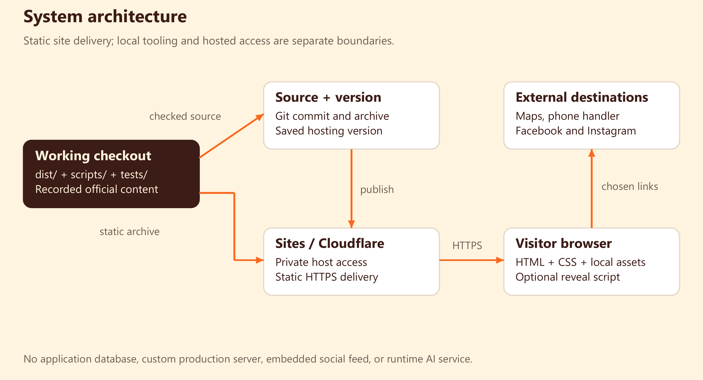
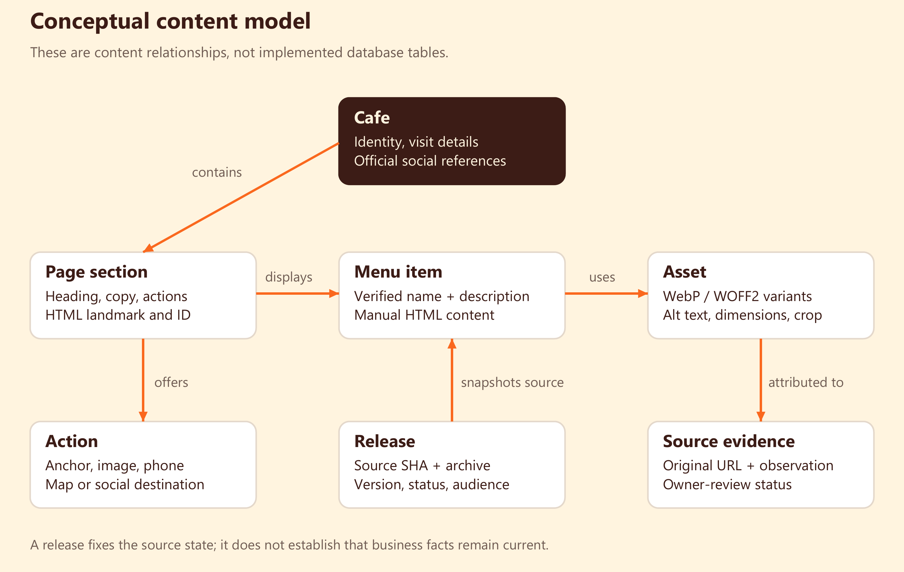
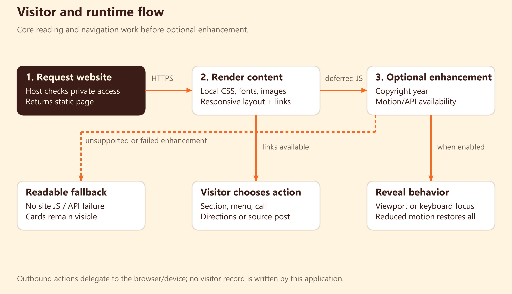
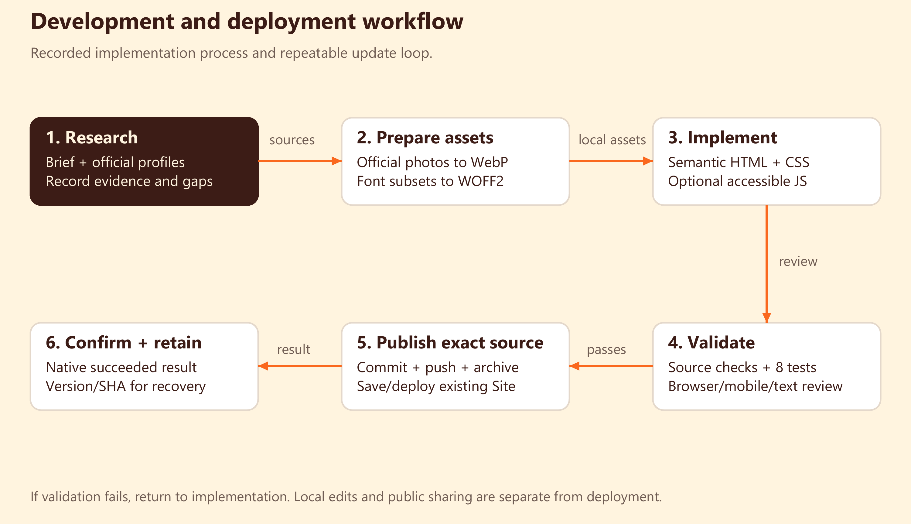

# Ragsak Manila Cafe

> Historical handbook: this document and its PDF describe the earlier single-page Sites release. For the current three-page landing/menu/privacy implementation, source limitations, owner checklist, Cloudflare workflow and future reservation requirements, read [WEBSITE-UPDATE.md](WEBSITE-UPDATE.md). The old PDF has not been rebuilt for this update.

Technical documentation and build handbook

Prepared October 4, 2026 | Source: C:\KELVIN\Ragsak | Recorded release: version 3, private

## 01 Project overview and evidence

Ragsak is a responsive cafe website that helps visitors browse food and drink highlights, view cafe photography, find the recorded location, and contact the cafe. Its primary journey is homepage -> menu or visit section -> menu photograph, phone, Google Maps, or an official social profile.

The implementation is a static, single-page website. HTML holds the content, CSS controls the design and responsive layout, and a small browser script adds optional scroll reveals and updates the copyright year. Core content and links work without that script. There is no website database, API service, AI chat, reservation system, checkout, or contact form.

### Recorded state

| Item | Recorded value |
|---|---|
| Working folder | C:\KELVIN\Ragsak |
| Cloud URL | https://ragsak-manila-cafe.kelvindeasis2323.chatgpt.site |
| Hosting | Sites-managed static hosting, using its Cloudflare delivery platform |
| Deployment | Version 3; native deployment result: succeeded |
| Audience | Private, owner access; public sharing is a separate change |
| Source commit | a28583be1ffb58736657525245dadc208bc5bc0c |
| Earlier release | Version 2; d830f90fd16f9b28bc2210c9cfd6c55ce517e6fa |
| Local tooling | Node.js 22 or later; dependency-free npm scripts |

This handbook reconstructs the process from the site files, original image/font preparation scripts, owner source record, review report, screenshots, tests, Git history, and saved deployment result. It is not a transcript of every terminal command or a fresh live-site audit. Business evidence was recorded on October 1; fresh Facebook/Instagram checks were blocked or throttled during the October 4 review.

### AI model and authorship

Codex assisted with research, implementation, review, fixes, testing, and deployment. AI is a development tool here; it is not a component that visitors call. The source repository does not record an exact model ID, model settings, token use, or every prompt, so those details cannot be reconstructed reliably. The system model in this handbook means the website's architecture and conceptual content model.

### How to read this handbook

Owners can start with the project overview, operating workflow, and public-launch checklist. Developers should read the architecture, content model, runtime flow, implementation, test strategy, and release workflow. The final references identify the evidence used to support the account.

## 02 Requirements and design direction

The original brief asked for a complete responsive site, grounded in Ragsak's official profiles and imagery. It specified six main sections, functional navigation, optimized loading, readable contrast, keyboard access, reduced motion, and basic local SEO. It prohibited invented prices, promotions, awards, branches, reservations, brand history, testimonials, and stock food photography.

### Required experience

| Section | Content and action |
|---|---|
| Hero | Ragsak identity, food/coffee photo, View Menu, Get Directions |
| Menu highlights | Verified croissant names and descriptions, coffee imagery, link to more detail |
| Menu details | The photographed Croissant Collection, source post, contact for the complete menu |
| Cafe experience | Short description supported by a verified table/space detail |
| Gallery | Official-profile photographs linked to their original posts |
| Visit and footer | Recorded address, phone, previously listed hours, social links, navigation |

The original brief's six sections include menu highlights and a full-menu destination. Because a current complete menu was not verified, the implementation provides the verified Croissant Collection and a call action for the complete menu. This is a deliberate content limit, not a claim that the entire menu is documented.

### Visual decisions

The design reference was Delice.ca: editorial serif headlines, saturated warmth, prominent branding, organic photo framing, compact navigation, and restrained motion. The resulting page uses Ragsak's logo and its recorded official photographs; the reference site's logo, copy, and assets were not reused.

| Token | Value | Role |
|---|---|---|
| Orange | #fa681e | Hero and visit backgrounds |
| Cream | #fff4df | Main content and light text |
| Brown | #3c1c16 | Body text, dark buttons, footer |
| Red | #7b211c | Experience section and decorative ribbon |
| Display type | Fraunces | Large headings and selected labels |
| Body type | DM Sans | Reading text, navigation, actions |

The hero uses a large Ragsak wordmark and an organically framed food photograph. Menu images alternate rounded silhouettes. A staggered gallery gives photographs room while maintaining a regular grid. These are presentation decisions; the site does not infer new cafe services from its visual design.

## 03 System architecture



The repository is the editable source. Sites publishes a saved version of the checked-in static directory. Visitors request HTML, CSS, JavaScript, photographs, and fonts over HTTPS. The hosted platform handles private access; the page does not implement an application login screen, password storage, or a user database.

### Three distinct responsibilities

| Layer | Responsibility | Main files |
|---|---|---|
| Content and document structure | Sections, links, metadata, alt text, local business JSON-LD | dist/index.html; dist/404.html |
| Presentation | Typography, colors, grids, crop positions, responsive and print behavior | dist/style.css; dist/assets/*.woff2 |
| Progressive enhancement | Copyright year and accessible optional reveals | dist/site.js |
| Local development | HTTP preview and local QA fixtures | scripts/serve.mjs |
| Validation | Source checks and animation regression tests | scripts/check-site.mjs; tests/site.test.mjs |
| Release configuration | Existing Site identity and static/404 handling | .openai/hosting.json |

This is a separation of content, presentation, and behavior. It is not a React application or an MVC framework. The Node preview process runs on the developer's computer; it is not the production website server.

### External boundaries

Google Maps receives a directions URL containing the publicly listed cafe address. A phone link delegates to the visitor's device using tel:+639171571488. Facebook and Instagram links navigate to official profiles or source photographs. No social feed, map iframe, tracking script, or remote font service is embedded in normal page rendering.

### Persistence and scale

Business content persists in files and Git history. A saved hosting version identifies the exact source commit and packaged assets. No page visit creates an application record. Read-only static delivery avoids database queries and shared session state; traffic is handled by the hosting platform rather than a custom server pool. Capacity limits, cache headers, uptime guarantees, and load-test results are not established by this repository.

## 04 System and content model



The following entities describe how the content relates. They are documentation concepts; they are not database tables, JSON APIs, TypeScript classes, or a CMS schema in the current implementation.

| Entity | Important fields | Current representation |
|---|---|---|
| Cafe | Name, address, telephone, social URLs, previously listed hours, verification note | HTML hero/visit/footer; CafeOrCoffeeShop JSON-LD |
| Page section | ID, heading, text, actions, image references | HTML sections and landmarks |
| Menu item | Name, verified description, photo association, source post | Croissant highlight articles and menu-detail entries |
| Asset | Filename, type, dimensions, variant widths, alt text, crop position | dist/assets, HTML attributes, CSS |
| Source evidence | Source URL, observation date, attributed uploader, owner-review status | OWNER-REVIEW.md |
| Action | Visible name, anchor or external destination | HTML anchor elements |
| Release | Version, source SHA, archive, deployment status, audience | Git, hosting version record, local deployment.json |

### Relationships

One cafe has several page sections. Sections display menu items and reference assets. Assets can have several optimized variants and a recorded source post. An action navigates within the page, opens an asset, or delegates to an external service. A release packages a particular source state; it does not prove that every business detail is current.

### Business consistency rules

Address and telephone are repeated in visit content, the footer, Maps links, and structured data. A change must update all occurrences. Canonical, Open Graph URL, and JSON-LD website/menu URLs should match the actual website origin. Item names and descriptions should agree with the owner-approved menu and source record.

No published numeric prices appear in HTML text. The linked photographed menu contains historical prices, so a visible note warns that prices and availability may have changed. Opening days are not specified because the recorded Instagram listing provided a time range without a day-by-day schedule. No live open/closed status is calculated.

### Ownership versus attribution

The source record attributes selected uploads to Ragsak's official profiles. Attribution establishes where the team found an asset; it does not independently prove legal reuse rights or that an image depicts the currently intended location. Owner confirmation remains necessary before a customer launch.

## 05 Runtime and visitor workflow



On the main route, the browser reads the HTML and requests the stylesheet, local fonts, and images. The hero's preload uses the same srcset and sizes values as the visible image, allowing the browser to select the appropriate candidate. Lower-page images use lazy loading and asynchronous decoding where configured.

### Page interactions

| Action | Implementation | Result |
|---|---|---|
| Skip to content | #main; tabindex=-1 on main | Keyboard focus moves to the main landmark |
| View Menu / The menu | #menu | Scroll to highlights |
| Explore the menu | #menu-details | Scroll to the verified collection |
| Our cafe / Gallery / Find us | #experience / #gallery / #visit | Navigate to a page section |
| Photographed menu | assets/menu-960.webp | Open a local image; browser Back returns |
| Get Directions | Google Maps directions URL | External map navigation |
| Phone / Ask for full menu | tel:+639171571488 | Device phone handler |
| Source photograph / social link | Facebook or Instagram URL | External navigation |
| Back to top / brand | #home | Return to the hero |

### Reveal state model

Default content is visible. When IntersectionObserver and matchMedia are available and reduced motion is off, each reveal card can enter reveal-pending. On viewport intersection, its pending class is removed and observation stops. Keyboard focus also reveals it immediately. Switching to reduced motion reveals all pending cards and disconnects observation. If construction or observation fails, the catch path restores every card.

CSS exposes focused cards, respects prefers-reduced-motion, and exposes cards for printing. These safeguards keep enhancement optional. The website's content does not depend on animation succeeding.

### Errors and status

The hosted static configuration requests 404-page behavior and includes a branded 404.html. The local preview responds to GET and HEAD, returns 405 for other methods, rejects invalid encoded URLs with 400, blocks paths outside dist, and returns the missing-page document with 404. These local status behaviors are not evidence of every production host response.

External websites can be unavailable, require a login, or throttle requests. The site uses plain outbound links and cannot guarantee third-party page availability or that a device supports telephone links.

## 06 Build history and delivery workflow



### Original implementation

1. Translate the brief into a six-section cafe experience and a content-verification policy.
2. Research the official Facebook and Instagram profiles. Record address, telephone, previously listed hours, menu evidence, and selected photograph URLs.
3. Study the stated design reference for visual direction; create an original composition using Ragsak assets.
4. Prepare local WebP photograph variants and locally hosted font subsets.
5. Author the semantic static HTML, CSS theme, responsive grids, links, alt text, and small reveal script.
6. Review desktop and mobile views, keyboard focus, image loading, contrast, and source/asset links.
7. Push source, package the static files, save hosting versions, and publish a private review site.

The original source was saved in C:\Users\LENOVO\Documents\Codex\2026-10-01\new-chat\work\ragsak-site. The October 4 review restored that existing Site into C:\KELVIN\Ragsak, preserving its identity and history. The current project does not depend on the original folder to serve or deploy its existing assets.

### Review and hardening release

The follow-up review examined the complete source and existing hosting audience. It corrected mobile image preloading, keyboard-hidden reveal cards, reduced-motion changes, duplicate mobile CSS, relative font sizing, intrinsic grid overflow with doubled text, menu-price wording, hours wording, and accessible logo naming. It added a branded missing page, source checks, regression tests, a local preview script, security metadata, business URLs, and maintenance guidance.

The initial check exposed a test-fixture state-copy issue; it was fixed before all eight tests passed. Browser text-enlargement checks then exposed real gallery/footer sizing problems; grid shrinking and wrapping were corrected before release. The final source was committed and pushed, packaged, and published as version 3. Native hosting reported succeeded for that exact saved version.

### Repeatable loop

An update starts with an owner-approved content or design change. Edit the source, synchronize the CSP hash if JSON-LD changed, run checks, review the affected layouts and actions, and publish the exact checked source state. If validation fails, return to the edit step. After publication, retain the version and commit for recovery. Editing local files alone does not update the cloud site.

## 07 Research, assets, and image pipeline

The original source record lists Facebook's public intro for the address and telephone, Instagram's bio for the time range, and an official photographed Croissant Collection for item names and descriptions. No menu prices, awards, additional branches, customer reviews, or reservation service were invented.

### Recorded source URLs

| Evidence | URL |
|---|---|
| Facebook profile | https://www.facebook.com/p/Ragsak-Manila-Cafe-61554814388739/ |
| Instagram profile | https://www.instagram.com/ragsak.mnl.cafe/ |
| Croissant menu | https://www.facebook.com/photo/?fbid=122284165532160479 |
| Design reference | https://delice.ca/ |

These URLs identify the recorded sources, not a new verification performed for this documentation task. Follow-up checks encountered Facebook blocking and Instagram throttling. Current hours, menu completeness, prices, availability, contact details, and reuse permissions require owner confirmation.

### Photograph preparation

The original optimize_assets.py used Pillow to apply EXIF orientation, convert imagery to RGB, and save WebP derivatives. Most named photographs were processed with 480px and 960px target widths and a 1700px height cap, with WebP quality 83. The logo used a 320px bounding box and quality 92. Aspect ratio was preserved; names such as 960 describe the intended variant, not a guarantee that every file is exactly 960 pixels wide after a height cap.

The rice photograph is present as a single rice-960.webp variant. Its original conversion parameters are not established by that preparation script. The generated evidence/asset-inventory.csv records the actual dimensions, formats, and sizes of current asset files.

### Font preparation

The original prepare_fonts.py downloaded the font files referenced in saved Google Fonts CSS, used fontTools to subset character ranges and selected punctuation, and saved seven WOFF2 files. DM Sans supplies body/navigation weights; Fraunces supplies display regular, bold, and italic faces. CSS uses font-display:swap. The local font-license file is retained.

New languages or special characters may exceed the original subset and fall back to system fonts. Review font coverage before adding multilingual copy. New asset generation should use fresh approved originals rather than resizing already-compressed small derivatives.

### Production loading decisions

Local assets avoid reliance on expiring social-media image URLs. HTML srcset/sizes select resolution by layout; CSS controls visual crops without altering the stored photograph. The hero is high priority, while lower content is lazy loaded. Asset evidence and source links remain separate from the visual crop choices.

## 08 File map and implementation details

| File | Responsibility |
|---|---|
| dist/index.html | One-page site, headings/landmarks, navigation, actions, metadata, JSON-LD |
| dist/style.css | Theme variables, seven font faces, responsive grids, focus/print/motion styles |
| dist/site.js | Copyright year, progressive reveal behavior, focus and failure fallbacks |
| dist/404.html | Missing-page document and return-home action |
| dist/robots.txt | Current private crawler policy: Disallow: / |
| dist/assets/ | Optimized WebP images and WOFF2 fonts |
| dist/font-licenses.txt | Font license text |
| scripts/serve.mjs | Loopback preview server and non-shipped local QA fixtures |
| scripts/check-site.mjs | Static consistency/asset/metadata checks |
| scripts/sync-csp.mjs | Refresh the hash for the exact JSON-LD text |
| tests/site.test.mjs | Eight browser-script behavior tests using Node's VM and test runner |
| package.json | start, check, sync:csp scripts; Node engine requirement |
| .openai/hosting.json | Site project ID, static output path, missing-page policy |
| .gitignore | Excludes local artifacts, environment files, and runtime folders |
| Docs/ | This handbook, diagram images, source, and handoff evidence |

### Responsive behavior

CSS uses 1100px, 900px, 700px, and 380px width conditions, plus a 1600px large-screen photo adjustment. These are layout choices rather than device detection. On narrow screens, the logo sits above four navigation links, main feature grids stack, the gallery uses two columns, and contact content wraps. Flexible minmax tracks and min-width:0 prevent intrinsic text/image widths from forcing overflow. Font sizes use relative units to support text enlargement.

### Document metadata

The root includes a title, description, theme color, canonical URL, Open Graph text/URL, site favicon, referrer policy, private noindex/nofollow policy, and local business JSON-LD. The JSON-LD uses CafeOrCoffeeShop with name, description, telephone, address, website/menu URLs, and official social profiles. Unconfirmed opening days, coordinates, prices, and branches are omitted.

There is no generated social-sharing image. A sitemap is not shipped in the private review release. Public-launch work must update crawler/indexing policies together rather than merely remove the private gate.

## 09 Testing and review evidence

The October 4 review combined source inspection, static consistency checks, targeted script tests, and browser verification. Automated tests validate mechanisms; they cannot establish current business facts or legal rights to imagery.

### Automated validation

```powershell
Set-Location 'C:\KELVIN\Ragsak'
npm run check
```

The static checker validates unique IDs, one main heading, language/description, the focusable skip target, internal anchors, selected safe URL patterns, asset existence/nonempty files, image alt/dimension attributes, hero/preload matching, parseable business JSON-LD, canonical agreement, the CSP hash, focus/motion/print rules, crawler-policy consistency, and static output configuration.

Its recorded summary includes 39 href references, 11 image elements, and 20 distinct local asset references. The href count includes document head links; it is not a claim that 39 user buttons were clicked. The secret check detects selected obvious key markers, not every possible credential. The checker is a targeted consistency script, not a full HTML validator or security scanner.

| Regression case | Expected behavior |
|---|---|
| Card enters viewport | It becomes visible and is unobserved |
| Keyboard enters a card | Hidden content reveals immediately |
| Reduced motion enabled after load | All cards reveal; observer disconnects |
| Reduced motion initially enabled | Content stays visible |
| IntersectionObserver missing | Content stays visible |
| matchMedia missing | Content stays visible |
| Observer constructor fails | Content stays visible |
| Observing a card fails | Previously hidden cards are restored |

### Browser and HTTP review

Normal layouts were checked at 320, 390, 700, approximately 701/702, 768, 1024, 1440, and 1920 pixels. Doubled root/body text was checked at 320, 390, 768, 1024, and 1440 pixels. No content clipped; the 768px doubled-text result showed a one-pixel page-width rounding extension. Decorative ribbon overflow is intentional and excluded from content overflow findings.

Seven internal navigation actions resolved to the expected anchors. Enter on the skip link focused main. Images loaded, the menu photograph opened and returned with browser Back, and content remained visible without the site script. No browser console errors/CSP violations appeared in the reviewed routes. Local checks returned 200 for the root/menu asset, 404 for a missing route, and 400 for a malformed encoded URL.

Primary color contrast was recorded as about 5.16:1 brown/orange, 14.06:1 brown/cream, and 9.27:1 cream/red. These ratios cover those foreground/background pairs, not every possible rendered element.

There is no claimed Lighthouse score, production Core Web Vitals measurement, load test, full screen-reader certification, or penetration test. Evidence files record the checks actually performed.

## 10 Cloud deployment and release model

The current release uses the existing Site rather than a newly registered duplicate. Its manifest identifies appgprj_6abd39ca6d4c819184c01db221277ede. This identifier is configuration, not a password or API credential.

```json
{
  "static": {
    "directory": "dist",
    "not_found_handling": "404-page"
  },
  "project_id": "appgprj_6abd39ca6d4c819184c01db221277ede"
}
```

### Release sequence used

1. Read the existing Site and confirm ownership/current private audience.
2. Obtain a short-lived source-repository write credential through the hosting connector. Keep it in session memory and stdin; do not write it to source or documentation.
3. Open/synchronize the existing source with the Sites workflow helper and use its returned checkout.
4. Complete edits and required validation.
5. Commit and push the exact checked source. Verify the remote source SHA matches the local commit.
6. Package the configured static directory and hosting metadata. Do not package local QA evidence, scripts, Docs, .git, or environment secrets as website assets.
7. Save and deploy that source/archive as an owner-private version.
8. Require a native succeeded result; retain version, source SHA, deployment ID, and URL.

The review used the installed site-workflow.mjs helper for source opening, committing, pushing, and packaging. Its packaging path uses Bash and tar; Windows Git Bash supplied the required shell tools. The credential was renewed when it expired. These are deployment-machine requirements, not dependencies required by website visitors or by npm start.

The saved version record identifies version 3 and source commit a28583be1ffb58736657525245dadc208bc5bc0c. The archive-backed version and successful deployment refer to that same source. Hosting URL presence alone would not prove successful publication; the succeeded state supplies the confirmation.

### Access and indexing

The review release preserves private owner access. The noindex/nofollow directive and robots Disallow policy discourage crawling but do not implement authentication. Private access is enforced by the host. Public sharing requires an explicit audience change on this same Site and corresponding indexing updates. Domain configuration is separate from source publication.

### Rollback

If a release breaks navigation, images, or intended access, redeploy the previous working saved version on the same Site, preserving the intended audience. Version 2 is the recorded pre-review baseline. Validate the successful rollback result and key flows. Restoring local files without deploying them does not restore the hosted site.

## 11 Local workflow and maintenance runbook

### Start and stop

Use Node.js 22 or later. No application dependencies need to be installed and no compilation/build command is required.

```powershell
Set-Location 'C:\KELVIN\Ragsak'
npm start
```

Open http://127.0.0.1:4187/. Keep the terminal running and refresh after edits. Ctrl+C stops the local process; it does not stop the cloud deployment. If the port is occupied, stop the earlier preview or start a different port:

```powershell
$env:PORT = '4188'
npm start
```

### Change content safely

For an address/phone change, update visit, footer, Maps URLs, and JSON-LD together. For hours, record verified opening days and holidays before publishing a definitive schedule. For menu changes, use the current owner-approved item names/descriptions and replace any obsolete photographed menu. For photos, use approved originals, produce suitable WebP variants, keep dimensions/alt text accurate, and update source attribution.

If the inline JSON-LD text changes, regenerate its CSP hash before checking:

```powershell
npm run sync:csp
npm run check
```

Review the affected section at desktop and mobile sizes, with keyboard input and enlarged text. For reduced-motion/script changes, run the existing behavior tests and review the fallback experience.

### Local-only QA fixtures

| URL | Purpose |
|---|---|
| /?qa=text200 | Adds a local stylesheet to double root text size |
| /?qa=nojs | Omits the site script from the local HTML response |
| /__qa__/text-200.css | Stylesheet served by the preview process only |

These fixtures alter the response in memory. They are not files in dist and are not hosted functionality.

### Publish an update

Ask Codex to review the changes in C:\KELVIN\Ragsak and redeploy the existing Ragsak Site while preserving its audience. Run the sequence in the release chapter. Keep a copy of the successful version result. Changes to Docs alone are local documentation work and do not require website publication.

### Troubleshooting

| Symptom | First useful check |
|---|---|
| Local page unavailable | Is npm start still running, and is the printed port correct? |
| Old content displayed | Refresh locally; check whether the cloud source was actually redeployed |
| Broken image | Match the HTML/srcset filename to a real asset; run check |
| CSP/structured-data error | Run sync:csp after editing JSON-LD, then check |
| Hidden card | Review focus/motion/failure tests; confirm CSS and script versions match |
| Customer cannot access URL | Check the host audience; the current release is private |
| Source push rejected | Reconcile remote history; do not force-push over another update |

## 12 Security, privacy, performance, and reliability

### Security boundaries

The production output contains static public-facing content rather than secret-bearing server code. It has no input forms, application API, SQL queries, passwords, user records, file-upload feature, or payment integration. This removes those application attack surfaces but does not eliminate host/account risks.

The HTML meta Content Security Policy restricts resources to the site's origin, disallows connections, objects, base changes, and form submissions, and allows the exact inline JSON-LD hash. The companion sync tool updates that hash when the business data changes. A meta CSP cannot provide every host-level directive; frame-ancestors and HTTP security headers need host-level handling. The referrer policy is strict-origin-when-cross-origin.

The local preview binds to 127.0.0.1 and checks path containment. Its no-store and nosniff headers describe local behavior only. It is a convenience server rather than a production server recommendation.

### Privacy and governance

The page does not embed analytics, social widgets, tracking pixels, external fonts, or map frames. Visitors choose when to follow outbound links. Private hosting has its own sign-in/access boundary, which is separate from application-level tracking. Never add credentials to dist or the documentation bundle. Keep owner/source confirmations current.

### Performance model

The site has no framework runtime, database round trips, or application package downloads. It serves local WebP and WOFF2 assets, applies responsive candidates, swaps fonts, lazy-loads lower images, and reserves image dimensions. Matching hero preload candidates avoids unnecessary alternate-resolution fetches.

Asset file size is measurable from the repository; actual initial transferred bytes depend on viewport, pixel density, cache, lazy-loading behavior, and the host. Do not equate the full asset inventory with one page load. Browser performance metrics and production caching behavior were not measured in the recorded review.

### Reliability model

Core reading/navigation stays usable if the reveal script or browser motion APIs fail. Missing routes have a return-home path. Local asset storage reduces dependence on third-party media URLs. Git/source versions support recovery. Remaining dependencies include the hosting service, domain/DNS configuration, owner account access, and external navigation destinations. The project has no configured uptime monitor or alerting automation.

## 13 Design decisions and future changes

| Decision | Reason | Cost / revisit trigger |
|---|---|---|
| Static single page | Fits cafe discovery and outbound actions; easy to publish | Revisit for many locations, regularly edited pages, or owner-managed content |
| HTML/CSS with small JS | Core experience works without a framework | Repeated content needs careful manual consistency |
| No database | No visitor submissions or durable transactions requested | Add only when an approved feature needs persistent records |
| Local images/fonts | Predictable assets and no expiring CDN dependency | Manual optimization and font-language coverage maintenance |
| Previously verified content | Avoid invented claims | Owner confirmation required for current business facts |
| Private review release | Preserves existing access | Customer launch needs audience and indexing work |
| Targeted validation | Tests the actual failure paths and consistency rules | Broader features will require broader tests |

### Public-launch checklist

Confirm address and phone; opening days, time range, and holiday policy; the current complete menu and availability; permission for logo/photo reuse; and the intended cafe location represented in photos. Then request public access on the same Site, replace private crawler policies, add a sitemap, run checks, and publish.

For a custom domain, use the exact domain you own. Obtain DNS records from the host and wait for verified routing/HTTPS before changing canonical, business, sitemap, and crawler URLs. Do not guess DNS targets or assume changing a canonical URL provisions a domain.

### Possible future architecture

An owner-facing CMS would require authenticated editing, validation, source/version history, and explicit publishing controls. Reservation/order/payment features would need a real authorized provider, error handling, privacy requirements, and transactional tests. More confirmed branches would need a location model and consistent per-location details. These are potential requirements, not features shipped in version 3.

## 14 Sources, diagrams, and handoff inventory

### Evidence used for this handbook

| Evidence | Location in this folder |
|---|---|
| Owner-confirmation and original source/photo record | reference/OWNER-REVIEW.md |
| October 4 review findings and validation limits | reference/REVIEW-REPORT.md |
| Existing editing, release, domain, and rollback guide | reference/DEPLOYMENT-GUIDE.md |
| Successful release/version record | evidence/deployment.json |
| Recorded responsive, text, and navigation observations | evidence/responsive.json; text-200.json; navigation.json |
| Existing reviewed page screenshots | evidence/desktop.png; mobile.png |
| Current image/font dimensions and sizes | evidence/asset-inventory.csv |

The original asset/font preparation scripts and Git history were inspected to establish the build account. They remain outside this documentation bundle; the instructions here explain the recorded pipeline without copying obsolete machine-specific download paths or embedding any publishing credential.

### Standalone diagram images

| Diagram | Purpose |
|---|---|
| system-architecture.png / .svg | Editable source, hosted delivery, browser, and external services |
| content-model.png / .svg | Conceptual content entities and relationships |
| runtime-flow.png / .svg | Reading/rendering, progressive enhancement, and visitor actions |
| development-workflow.png / .svg | Research, asset preparation, implementation, checks, and deployment |

PNG files are ready for presentations; SVG files preserve vector shapes and labels for reuse. The same diagrams appear in this PDF. All diagrams describe the existing system, with future possibilities discussed separately.

### Photo source registry

| Asset family | Original Facebook photo ID |
|---|---|
| logo.webp | 122125260812160479 |
| coffee-480/960.webp | 122284165616160479 |
| croissants-480/960.webp | 122284165676160479 |
| nutella-480/960.webp | 122284165592160479 |
| table-480/960.webp | 122284165508160479 |
| menu-480/960.webp | 122284165532160479 |
| rice-960.webp | 122199611696160479 |

Each original photo URL is https://www.facebook.com/photo/?fbid= followed by the listed ID. Full URLs, historical observations, and uses are retained in the owner record. Fonts are sourced from Google Fonts; included license text is in dist/font-licenses.txt.

### Maintaining this documentation

Update this Markdown when architecture, menu flow, file responsibilities, access, tests, or release practice changes. Rebuild the PDF/diagrams with tools/build_docs.py. Review the regenerated pages visually and verify the evidence dates. Docs is a local handoff folder and is outside dist; adding documentation does not change the live website or grant public access.
