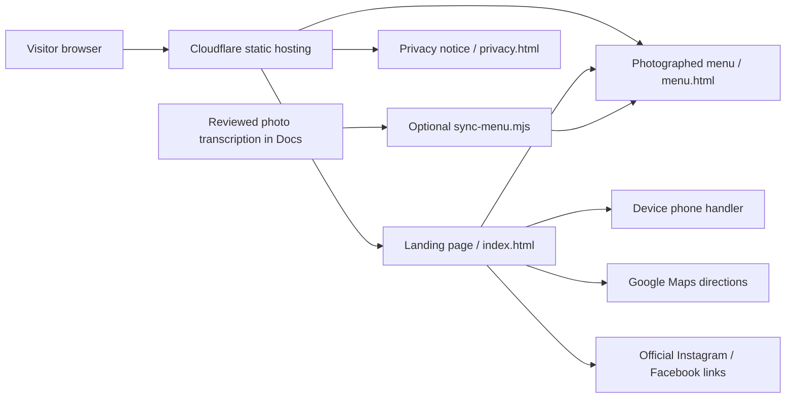

# Ragsak website update and owner checklist

Reviewed October 4, 2026. Working folder: `C:\KELVIN\Ragsak`. This is an independent landing page and digital business card, with a separate photographed-menu page. It has no booking, ordering, or payment service.

## Completed changes

- [x] Rebuilt the navigation with aligned branding, readable desktop links, and four visible mobile links with 44 px minimum heights.
- [x] Sized the hero to fill the initial viewport, including the header. The next section stays below the initial screen. Small landscape layouts use a compact two-column composition; enlarged text is allowed to grow instead of being clipped.
- [x] Added a native smooth-scroll cue to the menu preview, short photo/hover transitions, and small scroll reveals. Reduced-motion users get instant scrolling and no animation. Menu tables remain immediately readable.
- [x] Kept a concise three-category preview on the landing page and moved the photographed menu to `dist/menu.html`.
- [x] Transcribed 45 readable entries across seven categories, including ten breakfast entries, 32 drinks, and three previously recorded croissants. Excluded one uncertain drink name from text. Included original photographed wording for comparison.
- [x] Converted the two supplied menu photographs to full-frame WebP files. Their @wtg_quests watermark remains visible. The source JPGs are not present in this checkout; the WebP files are the distributable copies.
- [x] Reworked “A Closer Look” around a shared-table experience. The latest phase 3 photo and “Make time to gather” copy describe its warm lamp and patterned tabletop, without claiming seating or curtains absent from the new photo. It no longer repeats a dish list.
- [x] Replaced all three “On the Menu” photos and the “A Closer Look” photo with optimized phase 3 assets. Broad coffee, rice-plate and croissant categories are matched without guessing exact dish names or ingredients. See [the phase 3 photo checklist](PHASE-3-PHOTOS.md) and asset/browser evidence.
- [x] Phase 3 follow-up passed eight desktop/mobile viewports, 32 photo loads, six category-link clicks, four reduced-motion/no-script/enlarged-text checks and all 11 regression tests. Visually checked desktop/mobile section screenshots and fixed mobile heading spaces.
- [x] Connected “Ask for the Menu” to `tel:+639171571488`, corroborated in the official July 26 Instagram caption during this review. No fake form, placeholder contact, or reservation button is present.
- [x] Reviewed the official Instagram profile and three official photo/reel posts through direct browser access after the initial web fetch was throttled. Added an outbound link to the café’s September 4 reel; no embedded player or third-party requests on page load.
- [x] Internal pages, fragments, and local photos use the current tab. External websites/social/maps open a new tab on desktop, and the current tab on narrow or coarse-touch devices, including landscape phones. Telephone links invoke the device’s normal handler. Reduced-motion settings do not affect link behavior.
- [x] Added the exact requested disclaimer and a privacy link to all four HTML pages, including the error page.
- [x] Added `dist/privacy.html`, describing the actual static code, absence of site analytics/cookies/forms/embeds, Cloudflare hosting requests, and user-initiated phone/maps/social links.
- [x] Removed the old Sites canonical/OG URL and official-business structured data. The current Cloudflare domain has not been supplied; no deployment URL or official-business status is asserted. Search indexing remains disabled for the concept.
- [x] Updated source checks for all pages, cross-page anchors, assets, disclaimer, menu transcription, and security policies; added responsive external-link regression tests.
- [x] Passed 51 normal page/viewport checks, 12 enlarged-text page/width checks, reduced-motion and no-script checks, keyboard navigation, seven category jumps, and desktop/mobile/landscape-touch link clicks. All loaded images passed; no horizontal overflow or console errors remained. Eleven regression tests passed.

## Remaining issues and owner confirmation

- [x] **Latest hero redesign:** uses the user-selected `images/menu/ragsak bg.jpg` wall-sign photograph, with original preserved and optimized 640/960/1536 px WebP variants. Replaced the framed coffee photo with an edge-to-edge dark composition, matching homepage navigation, a warm orange accent, large serif headline, clear menu/directions controls, and a native scroll cue. The full sign is preserved on portrait phones. Short transform/opacity entrance animations respect reduced motion and work without JavaScript; controls are immediately usable. Alt text, dimensions, preload and source hashes updated together. Seventeen normal viewports plus enlarged-text/no-script/reduced-motion/link checks passed. Earlier coffee assets remain available. Reuse permissions still need owner/source confirmation.
- [ ] **Complete menu verification through Instagram:** the profile, July 26 photo post and July 27 / September 4 reels were accessible through direct browser access. Their captions corroborate the Maceda location/contact and broad food/drink offering, but do not verify every photographed menu row or current price. Complete owner-approved menu and media reuse permissions still need confirmation. Facebook blocked fresh fetching; its earlier photo records remain historical evidence.
- [ ] **Current menu and prices:** the supplied photos have no capture/revision date. Confirm every entry, drink size and printed amount, plus the currency (the supplied breakfast/drinks photos print figures without a currency symbol). The older official croissant photo explicitly prints peso amounts, retained as historical figures.
- [ ] **Uncertain frappé name:** the photo appears to read “CAMPIRE WHITE MOCHA,” with 195 / 205 in the two cold sizes. Do not silently correct it to “Campfire” without owner confirmation. This row is excluded from the accessible text menu and remains visible in the distributed WebP photo.
- [ ] **Hours:** breakfast photo and current Instagram bio say 10 AM–1 AM; drinks photo and September 4 reel caption say 10 AM–1:30 AM; July 26 caption says 10 AM–2 AM (last call 1:30 AM). Confirm the current schedule, opening days and holidays. The website displays no definitive schedule or live open/closed indicator.
- [ ] **Location scope:** current official July 26 Instagram caption corroborates `+63 917 157 1488` and `1276 Maceda St., Sampaloc, Manila`. Barangay 514 is from the earlier Facebook record. Current posts also mention an España branch, which is not added to this Maceda-focused design; confirm the intended branch scope and photos with the owner.
- [ ] **Photo and logo permission:** obtain reuse permission for earlier official photos/logo and the supplied @wtg_quests-watermarked photos. User supply and public attribution do not establish permission. Do not remove watermarks. Confirm that atmosphere photos represent this location.
- [ ] **Ingredients, allergens and dietary claims:** no new ingredient/allergen claims were inferred. Get a current owner-approved list before adding them.
- [ ] **Phase 3 photo identities:** confirm the exact dish/drink names, ingredients, source provenance, intended branch and current availability of the four new photographs. Only broad visible categories are used; unresolved identities are recorded in [PHASE-3-PHOTOS.md](PHASE-3-PHOTOS.md).
- [ ] **Deployment configuration:** confirm the actual Cloudflare project/domain, connected repository and production branch, publishing directory `dist`, and any host-level analytics/security settings. Update privacy text if deployment settings add tracking or embedded content. Local testing cannot inspect those dashboard settings.
- [ ] **Publish the changes:** local source changes have not been committed, pushed or deployed during this update. Follow [the deployment guide](../DEPLOYMENT-GUIDE.md), then verify the production deployment’s commit and the public domain.

## Maintenance workflow

Edit page copy in `dist/index.html`, `dist/menu.html`, or `dist/privacy.html`; layout in `dist/style.css`; optional link/reveal behavior in `dist/site.js`. To change menu rows, edit `Docs/evidence/menu-transcription.json`, attach/record the approved source, run `npm run sync:menu`, then run `npm run check`. This generates only the marked table section of `menu.html`; it does not change other page content.

The site has no required build or package installation step. The checked-in `dist` directory contains everything served by Cloudflare. `scripts/prepare-menu-images.py` is an optional Pillow image-maintenance utility that needs the source JPGs at `images/menu/all day breakfast.jpg` and `images/menu/drinks.jpg`; those two files are not in this checkout. Python is not needed for hosting. Run the utility only after adding approved source photos, and visually check that their attribution is intact.

## Current system design

All fonts and photos are local. There is no browser API request, database, account, booking endpoint, social widget or embedded map. The hosting provider receives requests needed to serve the site; outbound services are visited only when their links are followed. Device-responsive link targeting and scroll reveals are optional JavaScript enhancements. Without JavaScript, all content and native links remain usable, with external links falling back to the current tab.

## Future ideas: reservations

Reservations are a future feature proposal only. No live “Reserve” action is shown. The reviewed July 26 official Instagram caption describes walk-in visits; the owner must approve a change to that policy before any booking service is launched. A functioning service would need:

1. **Owner rules and availability:** opening days, holidays, local time zone, table capacities, party sizes, visit durations, lead times, cutoff rules, staff overrides and walk-in allocation. A server must check availability, including simultaneous requests, and prevent duplicate or overlapping bookings.
2. **Booking storage and confirmation:** a persistent record with reference number, contact details, time, party size and explicit status. Clearly distinguish a request awaiting approval from a confirmed booking. Confirm only after successful storage and availability validation; support idempotency and retries.
3. **Changes and cancellation:** a verified way to view, change or cancel a booking; deadlines, policy and status updates; release the old capacity safely when a booking changes or is cancelled. Do not expose guest details through guessable identifiers.
4. **Contact notifications:** owner-approved email/SMS/contact providers, delivery status/retry handling, café staff alerts, customer confirmation and change/cancellation notices. Keep credentials on the server. Define what happens if notifications fail and provide an actual staff fallback.
5. **Operations and privacy:** staff authentication and permissions, availability management, audit trail, backups, rate limits, data-minimization and retention rules, a contact channel and a revised privacy notice. Obtain owner authorization and consider actual provider costs before choosing services.
6. **Testing:** timezone/daylight-boundary and holiday cases, full capacity, simultaneous submissions, duplicate retries, changes/cancellations, expired links, invalid inputs, network/provider failures, notification delivery, access control, privacy, keyboard/screen-reader and mobile flows. Run a full guest/staff acceptance test before displaying a live booking button.

## Verification evidence

See [the current review report](../REVIEW-REPORT.md) and `Docs/evidence/redesign-responsive.json` / `redesign-interactions.json` for the browser results. `instagram-access.json` records the browser source review; `redesign-assets.json` records supplied photo hashes and the completed hero replacement. Screenshots are named `redesign-desktop.png`, `redesign-mobile.png`, `redesign-menu-desktop.png`, and `redesign-menu-mobile.png` in `Docs/evidence`. `hero-replacement.json` records the follow-up viewport checks.

The original PDF handbook and four illustrated diagrams describe an earlier single-page Sites release. They are retained as a historical build record; this checklist and current source/review files describe this update. A successful local check does not confirm a new Cloudflare deployment.
