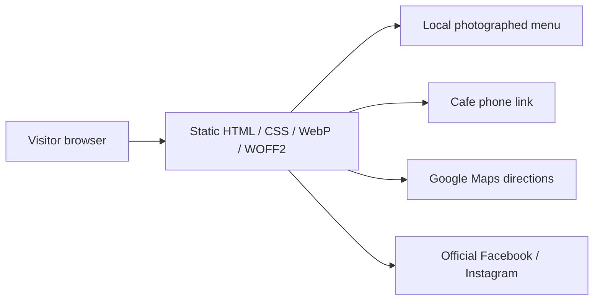

# Ragsak Manila Cafe — owner review and source record

Public profiles checked on October 1, 2026 (Asia/Shanghai). This is a private review website. Review the items below before sharing publicly.

## Confirm with the owner

1. **Complete menu and availability:** The site transcribes only the Croissant Collection verified in an official photographed menu. Obtain the current complete food/drinks menu, approve exact dish descriptions, and confirm availability at the listed location. Prices are omitted from site text; the source menu photograph contains its published prices and is not a promise of current pricing.
2. **Opening days and holiday hours:** Instagram currently lists 10am–1am without a day-by-day schedule. The site does not assume seven-day opening or display a live open/closed status.
3. **Location and photography:** Facebook currently lists 1276 Maceda Street, Barangay 514, Sampaloc, Manila and 0917 157 1488. Confirm that the featured food/table photographs represent the intended cafe location. No additional branch is presented.
4. **Brand assets and photos:** Approve website reuse of the selected official uploads and supply an original high-resolution logo if available. The orange logo comes from Facebook’s profile picture; Instagram’s profile picture uses a different wordmark. A full-room original interior photograph was not verified; only the cafe’s own table/space detail is used.

## Verified business content

| Content | Official source | Evidence |
|---|---|---|
| Address and phone | https://www.facebook.com/p/Ragsak-Manila-Cafe-61554814388739/ | Public Intro lists 1276 Maceda Street, Barangay 514, Sampaloc Manila; 0917 157 1488 |
| Hours | https://www.instagram.com/ragsak.mnl.cafe/ | Bio: “Opening Hours: 10am to 1am”; no days specified |
| Croissant names/descriptions | https://www.facebook.com/photo/?fbid=122284165532160479 | Menu lists Pistachio Kataifi Royale, Nutella Almond Indulgence, Biscoff Cookie Butter Bliss; cream/toppings and ice cream |
| Espresso | https://www.facebook.com/photo/?fbid=122125260812160479 | Official caption describes espresso coffee; historical bean sourcing claim deliberately omitted |

## Every image and its source

All included photographs are visible as uploads attributed to Ragsak Manila Cafe. This source attribution does not independently establish ownership/licensing. No customer posts, reviews, customer-watermarked imagery, reference-site assets, stock photos, or generated food imagery are included.

| Website asset | Source URL | Use |
|---|---|---|
| logo.webp | https://www.facebook.com/photo/?fbid=122125260812160479&set=a.122104172876160479 | Orange official profile logo, published February 14, 2024; navigation/footer/favicon |
| coffee-480.webp / coffee-960.webp | https://www.facebook.com/photo/?fbid=122284165616160479&set=a.122104199348160479 | Hero, coffee highlight, gallery; coffee and croissants |
| croissants-480.webp / croissants-960.webp | https://www.facebook.com/photo/?fbid=122284165676160479&set=a.122104199348160479 | Pistachio croissant highlight |
| nutella-480.webp / nutella-960.webp | https://www.facebook.com/photo/?fbid=122284165592160479&set=a.122104199348160479 | Nutella highlight and gallery |
| table-480.webp / table-960.webp | https://www.facebook.com/photo/?fbid=122284165508160479&set=a.122104199348160479 | Cafe atmosphere/table detail and gallery |
| menu-480.webp / menu-960.webp | https://www.facebook.com/photo/?fbid=122284165532160479&set=a.122104199348160479 | Linked photograph of the verified Croissant Collection |
| rice-960.webp | https://www.facebook.com/photo/?fbid=122199611696160479&set=a.122108443322160479 | Gallery; official cover photograph, January 28, 2025. Dish names not asserted |

Images are locally stored WebP derivatives of the downloaded official media; they do not rely on expiring social-media CDN URLs. Gallery images link to their original posts. Original downloaded media remain in the working files. Font sources: Google Fonts, DM Sans and Fraunces, served locally as subset WOFF2 files.

## Implementation and tradeoffs

The site is a static, single-page website with semantic HTML, responsive CSS, and one small script for IntersectionObserver reveals. User flow: homepage → menu/visit → official menu photograph, cafe phone, social profile, or Google Maps directions. No server, booking service, account, forms, database, or third-party tracking is needed.

Static delivery keeps loading fast and business content easy to review. It requires manual updates when the menu/hours change. Structured local business data includes verified name, address, telephone, and social profiles; uncertain opening days, coordinates, prices, and additional branches are omitted. Revisit content management when frequent owner updates or several confirmed locations become necessary. Add ordering/booking only after the owner supplies and authorizes an actual service.

## Design reference

https://delice.ca/ was studied for editorial type scale, saturated color, organic photo framing, compact navigation, and restrained motion. Ragsak’s composition, copy, logo, and photography are original to this implementation or drawn from the official sources above.
